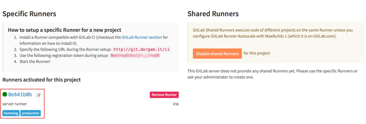

# ChatOps with Rocket.Chat
## Inspired in Gitlab: "From Idea to Production"

We've all got pretty amazed with the Gitlabs Idea to Production demonstration. But the stack they used, well, let's just say that it could be better. So we took the challenge and prepared this tutorial, with a much cooler stack to take your ideas to production, with Gitlab, Rocket.Chat and Hubot, all packed inside  Docker containers.

Let's call it:

##Chat, code and ship ideas to production

Let's take a look to this stack first, we will be running the following services containers:

- Gitlab CE (latest)  
- Rocket.Chat (latest)  
- MongoDB (3.2)
- Hubot-RocketChat (latest)
- Gitlab-Runner (latest with Dockerfile)
- Nginx (latest as a reverse proxy)

## How does it work?

First we need to setup our environments, and if it's your first time running it, you should follow this instructions carefully, so we can get everything connected.

After that, to bring it all up, you'll just need to enter in the directory and run the command:

``` 
docker-compose up -d
```

To stop all services:

```
docker-compose stop
```
### GITLAB CE

In our docker-compose.yml, adjust the following variables:

```javascript
      GITLAB_OMNIBUS_CONFIG: |
        external_url 'http://git.dorgam.it/' 
        gitlab_rails['gitlab_shell_ssh_port'] = 22
        gitlab_rails['lfs_enabled'] = true
        nginx['listen_port'] = 8081

```
You should set your external domain url, and leave the others.
 
>INFO: because we can't have more than one container lintening in the same port number, our services will be all listening in different ports, and we will let a NGINX reverse proxy take care of the rest.

Then set your volumes to make sure your data will be persisted:

```javascript
    volumes:
      - ./gitlab/config:/etc/gitlab
      - ./gitlab/logs:/var/log/gitlab
      - ./gitlab/data:/var/opt/gitlab
```
If your docker installation accepts your working directory as a volume, you can use the relative path.

And then we create a common shared network so the containers can communicate to each other. We will set a static ipv4 address, so we can use in others containers hosts files:  

```javascript
    networks:
      devops:
        ipv4_address: 172.20.0.4
```

Now, you should just enter in terminal, and type inside this directory:

```
docker-compose up -d gitlab
docker logs -f chatops_gitlab_1
```

Now you will see the containers logs, it takes a while, but you can make sure that gitlabs is running accessing http://git.dorgam.it:8081 in your browser.

### Gitlab Runner

You will need a registered runner to work with your pipeline, so we got the gitlab/gitlab-runner docker image and created a Dockerfile in ./gitlab/runner to install a nginx http server inside it and register it in your gitlab.
This is actually the most trick part, we know we shoudn't put two services inside the same container, but remember this is just an example, in real life, you will have your own server with your own runners.

So, you will find in docker-compose.yml:

```javascript
  runner:
    build: ./gitlab/runner/
    hostname: "runner"
    restart: "always"
    volumes:
      - /var/run/docker.sock:/var/run/docker.sock
    links:
      - gitlab
    environment:
      - GITLAB_HOST=gitlab:8081
    ports:
      - "8000:8000"
    expose:
      - "8000"
    networks:
      devops:
        ipv4_address: 172.20.0.5

```

We've set a env variable `GITLAB_HOST=gitlab:8081`, using the service name as url address, that only will work inside docker network, where containers can find each other by the service name.

Let's go to the terminal and build our runner:

```
docker-compose build runner

```

If everything goes well, just put it up:

```
docker-compose up -d runner
```

Once the runner's container is up, you need to register it in your gitlab. Go at the runners page of your gitlab project and copy the token to the `-r` option, then we will put your external url domain inside the /etc/hosts file so the runner knows where your git repository is, and then register your runner:

```shell
docker exec -it chatops_runner_1 /bin/bash -c "echo '172.20.0.10     git.dorgam.it' >> /etc/hosts"

docker exec -it chatops_runner_1 /usr/bin/gitlab-runner register -u http://gitlab:8081/ci -r BwU14yBJbnJjTv_uYaX8 --name "server runner" --executor shell --tag-list homolog,production --non-interactive
```

> TIP: You can also set a volume for the /etc/hosts file, so it will be persisted in your host machine. 


> EXPLAIN: docker exec -it [name-of-container] [command]  
> You can get the name of your container using `docker ps`

A message like this should appear:

```
Registering runner... succeeded                     runner=BwU14yBJ  
Runner registered successfully. Feel free to start it, but if it's running already the config should be automatically reloaded! 
```

You can check if your runner is communicating by going to the Gitalabs Runner's page.


### MongoDB

First start mongodb container, then we need to start mongo-init-replica, so mongodb turns into a replica set primary server. In the terminal:

```
docker-compose up -d mongo
```

> TIP: You can check the logs by using `docker logs -f [container_name]`, it's better than being attached to the container.

When it's done, run:

```
docker-compose up -d mongo-init-replica
```

This will initiate the replicaset configuration, and exit the container. 

### Rocket.Chat

To put Rocket.Chat up you just need to set the environment variables `PORT` and `ROOT_URL` and run it:

```javascript
  rocketchat:
    image: rocketchat/rocket.chat:latest
    hostname: 'rocketchat'
    volumes:
      - ./rocketchat/uploads:/app/uploads
    environment:
      - PORT=3000
      - ROOT_URL=http://chat.dorgam.it:3000
      - MONGO_URL=mongodb://mongo:27017/rocketchat
      - MONGO_OPLOG_URL=mongodb://mongo:27017/local
      - MAIL_URL="smtp://smtp.google.com"
    links:
      - mongo:mongo
      - gitlab:gitlab
    ports:
      - 3000:3000
    expose:
      - "3000"
    depends_on:
      - mongo
    networks:
      devops:
        ipv4_address: 172.20.0.8
```

You can set MongoDB address, if you're using another service, and `MAIL_URL` in case you have a internal smtp server.

Run:
```
docker-compose up -d rocketchat
```

Now go register your Rocket.Chat Admin user, by http://chat.dorgam.it:3000/, and **create a user and a channel for the bot.** 

### Hubot

Hubot is our framework for building bots, my favorite actually, here you can set a lot of params, just keep in mind that most of hubots scripts crashes if they don't find their environment variables, so be carefull when configuring these:

```javascript

  hubot:
    image: rocketchat/hubot-rocketchat:latest
    hostname: "hubot"
    environment:
      - ROCKETCHAT_URL=rocketchat:3000
      - ROCKETCHAT_ROOM=devops
      - ROCKETCHAT_USER=rocket.cat
      - ROCKETCHAT_PASSWORD=bot
      - ROCKETCHAT_AUTH=password
      - BOT_NAME=Rocket.Cat
      - LISTEN_ON_ALL_PUBLIC=true
      - EXTERNAL_SCRIPTS=hubot-help,hubot-seen,hubot-links,hubot-diagnostics,hubot-gitsy,hubot-gitlab-agile
      - GITLAB_URL=http://gitlab/api/v3/
      - GITLAB_API_KEY="cNhsKKLDNslKDkiS"
      - GITLAB_TOKEN=cNhsKKLDNslKDkiS
      - GITLAB_RECORD_LIMIT=100

    links:
      - rocketchat:rocketchat
      - gitlab:gitlab
    volumes:
      - ./hubot/scripts:/home/hubot/scripts
  # this is used to expose the hubot port for notifications on the host on port 3001, e.g. for hubot-jenkins-notifier
    ports:
      - 3001:3001
    networks:
      devops:
        ipv4_address: 172.20.0.9
```

First you need to change `ROCKETCHAT_ROOM`, `ROCKETCHAT_USER`, that will be the username that you created in rocket.chat, and `ROCKETCHAT_PASSWORD` in plain text. As you can see I'm using Rocket.Cat, a natural rocket.chat bot, that comes with the installation, but you can create another one at your own image.

In the `./hubot/scripts` folder we can persist hubots scripts, there is a lot of then in github, you will be amazed.

Save your changes and run:

```
docker-compose up -d hubot
```

Check the logs to see if everything went well and then go to your channel and ask for a "yoda quote", just for fun.

### NGINX Reverse Proxy

So as we've said before, docker containers can't connect to the same port simultanesly, that's why each service has it's own port, but that's not cool for the a user friendly experience, so what we've done here is putting a NGINX Reverse Proxy in front of every service, listening to port 80 (and 443 if you like) and proxy_passing the connections to the services on their own port.

The NGINX configuration file is persisted in `./nginx/chatops.conf`, and you should change the domain names if you want.

```javascript
upstream chat{
  ip_hash;
  server rocketchat:3000;
}

server {
  listen 80;
  server_name chat.dorgam.it;
  error_log /var/log/nginx/rocketchat.error.log;

  location / {
    proxy_pass http://chat;
    proxy_http_version 1.1;
    proxy_set_header Upgrade $http_upgrade;
    proxy_set_header Connection "upgrade";
    proxy_set_header Host $http_host;

    proxy_set_header X-Real-IP $remote_addr;
    proxy_set_header X-Forward-For $proxy_add_x_forwarded_for;
    proxy_set_header X-Forward-Proto http;
    proxy_set_header X-Nginx-Proxy true;

    proxy_redirect off;
  }
}

server {
  listen 80;
  server_name git.dorgam.it;
  error_log /var/log/nginx/gitlab.error.log;


  location / {
    proxy_pass http://gitlab:8081;
    proxy_redirect off;
    proxy_set_header Host $http_host;
    proxy_set_header X-Real-IP $remote_addr;
    proxy_set_header X-Forwarded-For $proxy_add_x_forwarded_for;
    proxy_set_header X-Forwarded-Proto $scheme;
    proxy_set_header X-Forwarded-Protocol $scheme;
    proxy_set_header X-Url-Scheme $scheme;
  }
}

server {
  listen 80;
	server_name www.dorgam.it;

	location / {
		proxy_pass http://runner:8000;
    proxy_redirect off;
    proxy_set_header Host $http_host;
    proxy_set_header X-Real-IP $remote_addr;
    proxy_set_header X-Forwarded-For $proxy_add_x_forwarded_for;
    proxy_set_header X-Forwarded-Proto $scheme;
    proxy_set_header X-Forwarded-Protocol $scheme;
    proxy_set_header X-Url-Scheme $scheme;
	}
}

server {
  listen 80;
	server_name hom.dorgam.it;

	location / {
		proxy_pass http://runner:8000;
    proxy_redirect off;
    proxy_set_header Host $http_host;
    proxy_set_header X-Real-IP $remote_addr;
    proxy_set_header X-Forwarded-For $proxy_add_x_forwarded_for;
    proxy_set_header X-Forwarded-Proto $scheme;
    proxy_set_header X-Forwarded-Protocol $scheme;
    proxy_set_header X-Url-Scheme $scheme;
	}
}

```

Just save your changes and:

```javascript
docchatops_ker-compose up -d nginx
```

When you change these confs, remember to reload then into NGINX:

```shell
docker exec -it chatops_nginx_1 /bin/bash -c "service nginx reload"
```

Hosts file is also persisted, so you can add or remove anything.

## Rocket.Chat Webhook Integration Script

Althougth Hubot is a very powerfull tool for bot scripting, you might wanna add some webhooks integration to our channels in Rocket.Chat.

For that, there is a pretty simple script that you can change as you like, to read the gitlabs webhooks and throw some messages inside your project channel.

Here is what you gonna do:

### Create Rocket.Chat Incoming WebHook

Access your rocket.chat from your browser (http://chat.dorgam.it) and go to the top menu (the little arrow besides your name) and click in Administration > Integrations > New Integration > Incoming WebHook.

Fill the form with the name of the script, the #channel (with sharp signal) where the messages will appear, and on until script. You activate script, and paste this script inside the script box:

```javascript
/* eslint no-console:0, max-len:0 */
// see https://gitlab.com/help/web_hooks/web_hooks for full json posted by GitLab
const NOTIF_COLOR = '#6498CC';
const refParser = (ref) => ref.replace(/^refs\/(?:tags|heads)\/(.+)$/, '$1');
const displayName = (name) => name.toLowerCase().replace(/\s+/g, '.');
const atName = (user) => (user && user.name ? '@' + displayName(user.name) : '');
const makeAttachment = (author, text) => {
	return {
		author_name: author ? displayName(author.name) : '',
		author_icon: author ? author.avatar_url : '',
		text,
		color: NOTIF_COLOR
	};
};
const pushUniq = (array, val) => ~array.indexOf(val) || array.push(val); // eslint-disable-line

class Script { // eslint-disable-line
	process_incoming_request({ request }) {
		try {
			let result = null;
			const channel = request.url.query.channel;
			switch (request.headers['x-gitlab-event']) {
				case 'Push Hook':
					result = this.pushEvent(request.content);
					break;
				case 'Merge Request Hook':
					result = this.mergeRequestEvent(request.content);
					break;
				case 'Note Hook':
					result = this.commentEvent(request.content);
					break;
				case 'Issue Hook':
					result = this.issueEvent(request.content);
					break;
				case 'Tag Push Hook':
					result = this.tagEvent(request.content);
					break;
        case 'Pipeline Hook':
					result = this.pipelineEvent(request.content);
					break;
			}
			if (result && result.content && channel) {
				result.content.channel = '#' + channel;
			}
			return result;
		} catch (e) {
			console.log('gitlabevent error', e);
			return {
				error: {
					success: false,
					message: e.message || e
				}
			};
		}
	}

	issueEvent(data) {
		return {
			content: {
				username: 'gitlab/' + data.project.name,
				icon_url: data.project.avatar_url || data.user.avatar_url || '',
				text: (data.assignee && data.assignee.name !== data.user.name) ? atName(data.assignee) : '',
				attachments: [
					makeAttachment(
						data.user,
						`${data.object_attributes.state} an issue _${data.object_attributes.title}_ on ${data.project.name}.
*Description:* ${data.object_attributes.description}.
See: ${data.object_attributes.url}`
					)
				]
			}
		};
	}

	commentEvent(data) {
		const comment = data.object_attributes;
		const user = data.user;
		const at = [];
		let text;
		if (data.merge_request) {
			const mr = data.merge_request;
			const lastCommitAuthor = mr.last_commit && mr.last_commit.author;
			if (mr.assignee && mr.assignee.name !== user.name) {
				at.push(atName(mr.assignee));
			}
			if (lastCommitAuthor && lastCommitAuthor.name !== user.name) {
				pushUniq(at, atName(lastCommitAuthor));
			}
			text = `commented on MR [#${mr.id} ${mr.title}](${comment.url})`;
		} else if (data.commit) {
			const commit = data.commit;
			const message = commit.message.replace(/\n[^\s\S]+/, '...').replace(/\n$/, '');
			if (commit.author && commit.author.name !== user.name) {
				at.push(atName(commit.author));
			}
			text = `commented on commit [${commit.id.slice(0, 8)} ${message}](${comment.url})`;
		} else if (data.issue) {
			const issue = data.issue;
			text = `commented on issue [#${issue.id} ${issue.title}](${comment.url})`;
		} else if (data.snippet) {
			const snippet = data.snippet;
			text = `commented on code snippet [#${snippet.id} ${snippet.title}](${comment.url})`;
		}
		return {
			content: {
				username: 'gitlab/' + data.project.name,
				icon_url: data.project.avatar_url || user.avatar_url || '',
				text: at.join(' '),
				attachments: [
					makeAttachment(user, `${text}\n${comment.note}`)
				]
			}
		};
	}

	mergeRequestEvent(data) {
		const user = data.user;
		const mr = data.object_attributes;
		const assignee = mr.assignee;
		let at = [];

		if (mr.action === 'open' && assignee) {
			at = '\n' + atName(assignee);
		} else if (mr.action === 'merge') {
			const lastCommitAuthor = mr.last_commit && mr.last_commit.author;
			if (assignee && assignee.name !== user.name) {
				at.push(atName(assignee));
			}
			if (lastCommitAuthor && lastCommitAuthor.name !== user.name) {
				pushUniq(at, atName(lastCommitAuthor));
			}
		}
		return {
			content: {
				username: `gitlab/${mr.target.name}`,
				icon_url: mr.target.avatar_url || mr.source.avatar_url || user.avatar_url || '',
				text: at.join(' '),
				attachments: [
					makeAttachment(user, `${mr.action} MR [#${mr.iid} ${mr.title}](${mr.url})\n${mr.source_branch} into ${mr.target_branch}`)
				]
			}
		};
	}

	pushEvent(data) {
		const project = data.project;
		const user = {
			name: data.user_name,
			avatar_url: data.user_avatar
		};
		// branch removal
		if (data.checkout_sha === null && !data.commits.length) {
			return {
				content: {
					username: `gitlab/${project.name}`,
					icon_url: project.avatar_url || data.user_avatar || '',
					attachments: [
						makeAttachment(user, `removed branch ${refParser(data.ref)} from [${project.name}](${project.web_url})`)
					]
				}
			};
		}
		// new branch
		if (data.before == 0) { // eslint-disable-line
			return {
				content: {
					username: `gitlab/${project.name}`,
					icon_url: project.avatar_url || data.user_avatar || '',
					attachments: [
						makeAttachment(user, `pushed new branch [${refParser(data.ref)}](${project.web_url}/commits/${refParser(data.ref)}) to [${project.name}](${project.web_url}), which is ${data.total_commits_count} commits ahead of master`)
					]
				}
			};
		}
		return {
			content: {
				username: `gitlab/${project.name}`,
				icon_url: project.avatar_url || data.user_avatar || '',
				attachments: [
					makeAttachment(user, `pushed ${data.total_commits_count} commits to branch [${refParser(data.ref)}](${project.web_url}/commits/${refParser(data.ref)}) in [${project.name}](${project.web_url})`),
					{
						text: data.commits.map((commit) => `  - ${new Date(commit.timestamp).toUTCString()} [${commit.id.slice(0, 8)}](${commit.url}) by ${commit.author.name}: ${commit.message.replace(/\s*$/, '')}`).join('\n'),
						color: NOTIF_COLOR
					}
				]
			}
		};
	}

	tagEvent(data) {
		const tag = refParser(data.ref);
		return {
			content: {
				username: `gitlab/${data.project.name}`,
				icon_url: data.project.avatar_url || data.user_avatar || '',
				text: '@all',
				attachments: [
					makeAttachment(
						{ name: data.user_name, avatar_url: data.user_avatar },
						`push tag [${tag} ${data.checkout_sha.slice(0, 8)}](${data.project.web_url}/tags/${tag})`
					)
				]
			}
		};
	}

  pipelineEvent(data) {
		const status = data.object_attributes.status;
		const link = data.project.web_url

		return {
			content: {
				username: `gitlab/${data.project.name}`,
				icon_url: data.project.avatar_url || data.user.avatar_url || '',
				text: 'Pipeline Active:',
				attachments: [
					makeAttachment(
						{ name: data.user.name, avatar_url: data.user.avatar_url },
						`Runned a Pipeline with status: ${data.object_attributes.status} [${data.object_attributes.duration}s] (${data.project.web_url}/pipelines)`
					)
				]
			}
		};
	}
}

```

As you can see, in Rocket.Chat even the integrations are full open sourced, you can change the messages inside the script if you like, by just changing the content prepared inside the event functions.

Save your integration and test it with curl, using some gitlab webhook json, like this:

```
curl -X POST -H "x-gitlab-event: Pipeline Hook" --data-urlencode 'payload={   "object_kind": "pipeline",   "object_attributes":{      "id": 31,      "ref": "master",      "tag": false,      "sha": "bcbb5ec396a2c0f828686f14fac9b80b780504f2",      "before_sha": "bcbb5ec396a2c0f828686f14fac9b80b780504f2",      "status": "success",      "stages":[         "build",         "test",         "deploy"      ],      "created_at": "2016-08-12 15:23:28 UTC",      "finished_at": "2016-08-12 15:26:29 UTC",      "duration": 63   },   "user":{      "name": "Administrator",      "username": "root",      "avatar_url": "http://www.gravatar.com/avatar/e32bd13e2add097461cb96824b7a829c?s=80\u0026d=identicon"   },   "project":{      "name": "Gitlab Test",      "description": "Atque in sunt eos similique dolores voluptatem.",      "web_url": "http://192.168.64.1:3005/gitlab-org/gitlab-test",      "avatar_url": null,      "git_ssh_url": "git@192.168.64.1:gitlab-org/gitlab-test.git",      "git_http_url": "http://192.168.64.1:3005/gitlab-org/gitlab-test.git",      "namespace": "Gitlab Org",      "visibility_level": 20,      "path_with_namespace": "gitlab-org/gitlab-test",      "default_branch": "master"   },   "commit":{      "id": "bcbb5ec396a2c0f828686f14fac9b80b780504f2",      "message": "test",      "timestamp": "2016-08-12T17:23:21+02:00",      "url": "http://example.com/gitlab-org/gitlab-test/commit/bcbb5ec396a2c0f828686f14fac9b80b780504f2",      "author":{         "name": "User",         "email": "user@gitlab.com"      }   },   "builds":[      {         "id": 380,         "stage": "deploy",         "name": "production",         "status": "skipped",         "created_at": "2016-08-12 15:23:28 UTC",         "started_at": null,         "finished_at": null,         "when": "manual",         "manual": true,         "user":{            "name": "Administrator",            "username": "root",            "avatar_url": "http://www.gravatar.com/avatar/e32bd13e2add097461cb96824b7a829c?s=80\u0026d=identicon"         },         "runner": null,         "artifacts_file":{            "filename": null,            "size": null         }      },      {         "id": 377,         "stage": "test",         "name": "test-image",         "status": "success",         "created_at": "2016-08-12 15:23:28 UTC",         "started_at": "2016-08-12 15:26:12 UTC",         "finished_at": null,         "when": "on_success",         "manual": false,         "user":{            "name": "Administrator",            "username": "root",            "avatar_url": "http://www.gravatar.com/avatar/e32bd13e2add097461cb96824b7a829c?s=80\u0026d=identicon"         },         "runner": null,         "artifacts_file":{            "filename": null,            "size": null         }      },      {         "id": 378,         "stage": "test",         "name": "test-build",         "status": "success",         "created_at": "2016-08-12 15:23:28 UTC",         "started_at": "2016-08-12 15:26:12 UTC",         "finished_at": "2016-08-12 15:26:29 UTC",         "when": "on_success",         "manual": false,         "user":{            "name": "Administrator",            "username": "root",            "avatar_url": "http://www.gravatar.com/avatar/e32bd13e2add097461cb96824b7a829c?s=80\u0026d=identicon"         },         "runner": null,         "artifacts_file":{            "filename": null,            "size": null         }      },      {         "id": 376,         "stage": "build",         "name": "build-image",         "status": "success",         "created_at": "2016-08-12 15:23:28 UTC",         "started_at": "2016-08-12 15:24:56 UTC",         "finished_at": "2016-08-12 15:25:26 UTC",         "when": "on_success",         "manual": false,         "user":{            "name": "Administrator",            "username": "root",            "avatar_url": "http://www.gravatar.com/avatar/e32bd13e2add097461cb96824b7a829c?s=80\u0026d=identicon"         },         "runner": null,         "artifacts_file":{            "filename": null,            "size": null         }      },      {         "id": 379,         "stage": "deploy",         "name": "staging",         "status": "created",         "created_at": "2016-08-12 15:23:28 UTC",         "started_at": null,         "finished_at": null,         "when": "on_success",         "manual": false,         "user":{            "name": "Administrator",            "username": "root",            "avatar_url": "http://www.gravatar.com/avatar/e32bd13e2add097461cb96824b7a829c?s=80\u0026d=identicon"         },         "runner": null,         "artifacts_file":{            "filename": null,            "size": null         }      }   ]}' http://chat.dorgam.it/hooks/7H6ridRv6n8wgfNvb/yPfDX488gXTstQCWN3BQYjjLEyN3BQYjjLEyAN3BQYjjLEyZoj
```

> TIP: With outgoing and incoming webhooks you can **connect Rocket.Chat to whatever you want**. You can be monitoring all of your services with Zabbix, Rancher, Puppet, or even CloudStack, Heroku, Azure, and basically everything that has a API to alert you.

That is what makes Rocket.Chat the most powerfull ChatOps opensource tool in the world!


## That's All Folks!

Now you have your own chatops environment set with Gitlab, Rocket.Chat and Hubot!

You can try to make your own CI Pipeline and get started with your interactions.

Please, feel free to contribute to this tutorial, and also take a look to our links below.

Thanks to all the guys that made it possible:  

- [https://hub.docker.com/r/rocketchat/hubot-rocketchat](https://hub.docker.com/r/rocketchat/hubot-rocketchat)  
- [https://github.com/github/hubot-scripts](https://github.com/github/hubot-scripts)  
- [https://gitlab.com/gitlab-org/omnibus-gitlab/](https://gitlab.com/gitlab-org/omnibus-gitlab/)  
- [Rocket.Chat Team](https://github.com/RocketChat/Rocket.Chat.Docs/blob/master/3.%20Installation/3.%20Docker%20Containers/Docker%20Compose.md)
